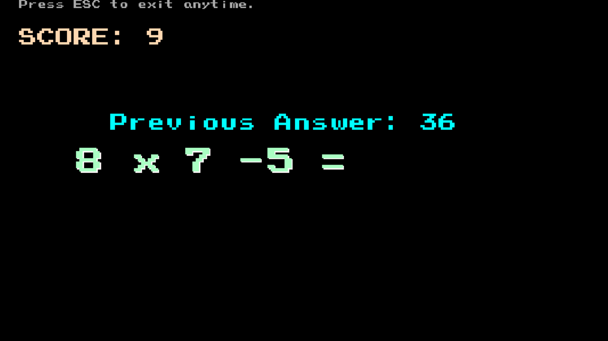

# Mult-Add Game: The Game of Multiplication and Addition

## About the Game

Mult-Add Game is a simple yet engaging math game designed to challenge your multiplication 
and addition skills. Inspired by the calculation exercises in the mobile app _Xiǎoyuán Kǒushuàn_
("小猿口算", i.e. XiaoYuan Quick Math), this game presents you with math problems in the form of 
"a * b + c" or "a * b".

## Game Features

- **Dynamic Questions**: The game generates random math problems, with a 70% chance of 
including an addend (+c or -c) to the multiplication result.
- **Scoring System**: Earn 1 point for each correct answer and see your score increase.
- **Feedback Mechanism**: After each answer, the previous correct answer is displayed, 
allowing you to track your progress.
- **Penalty for Incorrect Answers**: If you answer incorrectly without trying to correct
it, your input will be cleared, and the previous answer will be hidden as a small penalty 
to encourage focus and accuracy.

## How to Play

1. Start the game and wait for the first math problem to appear.
2. Use your keyboard to input the answer. Your answer will be automatically submitted.
4. If correct, you'll see the score update and the previous answer displayed.
5. If incorrect, your input will be cleared in 1.5 seconds, and you'll need to start over.

## Controls

- **Number Keys (0-9)**: Enter your answer.
- **Backspace**: Clear your current input manually.
- **ESC**: Exit the game at any time.

## Development

This game was developed using the [vbPixelGameEngine](https://github.com/DualBrain/vbPixelGameEngine), 
a fantastic game engine created by the talented developer [@Dual Brain](https://github.com/DualBrain).

If you find this project interesting or have any suggestions, feel free to star it or leave a 
comment. Please also keep in touch with [@Dual Brain](https://github.com/Dual-Brain) for creating
such a great tool that made this project possible!

## Contribution

Feel free to contribute to this project by submitting pull requests or reporting 
issues. Any contributions are welcome to enhance the game or fix bugs.

## License

This project is licensed under the [MIT License](LICENSE). Feel free to use, modify, 
and distribute the code as per the license terms.

---

Enjoy the game and challenge yourself with Mult-Add Game!